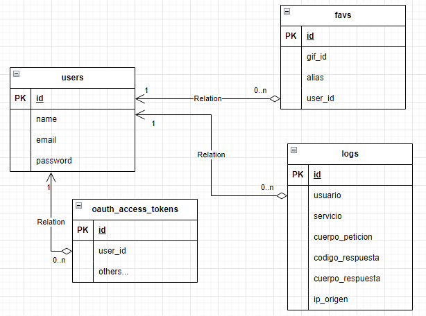

# API REST for Giphy

## Descripción
Se desea integrar la API de Giphy en un API REST Laravel que posee un conjunto de servicios como: Login, Buscar Gifs, Buscar Gif por id y Guardar Gif como favorito. Y adicionalmente un Register para crear nuevos usuarios.
La API REST posee una autenticación OAuth2.0.

## Diagramas

1. Diagrama de Casos de Uso:

    

2. Diagrama de Secuencia:

    

3. Diagrama de Datos:

    

## Instalación
1. Renombrar el archivo .end.dist como .env y colocar los valores correspondientes a la base de datos y al api key de Giphy.
2. Levantar el proyecto con Docker: docker-compose up.
3. Utilizar la colección de Postman para probar los servicios.

## Requerimientos
    PHP v8.2 o superior
    Laravel Framework v10
    MariaDB ó MySQL
    Docker