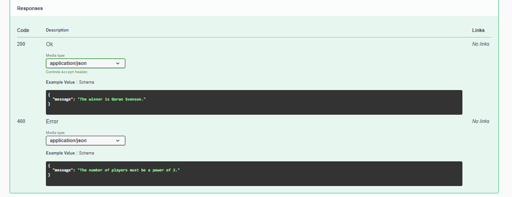

# Tennis Tournament API Simulator

## Description
We wish to simulate a men's or women's tennis tournament given a list of players with the names and characteristics of each player.
Each player has a skill level between 0 and 100.
If the tournament is for men, the strength and speed of movement are considered. And if it is female, the speed of reaction is considered. Another parameter is also luck.

## Configuration
If you wish, you can change the coefficient variables (COEF_) in the .env file, or you can leave them with the same values.
    
    # Incidence coefficient values for player skills
    # value_male = c1*skill + c2*strength + c3*speed + c5*luck 
    # value_female = c1*skill + c4*reaction + c5*luck
    # luck = rnd(0, max_value_luck)
    COEF_SKILL = 1
    COEF_STRENGTH = 0.5
    COEF_SPEED = 0.3
    COEF_REACTION = 0.4
    COEF_LUCK = 0.2
    MAX_VALUE_LUCK = 20

## List Structure
###  Male structure
    {
        "tournament_type": "male",
        "players": [
            {
                "name": "Goran Svenson",
                "skill": 95,
                "strength": 120,
                "speed": 18
            },
            {
                "name": "Juan Carrasco",
                "skill": 93,
                "strength": 121,
                "speed": 25
            }
        ]
    }

### Female structure
    {
        "tournament_type": "female",
        "players": [
            {
                "name": "Erika Stevenson",
                "skill": 95,
                "reaction": 85
            },
            {
                "name": "Beka Rosalut",
                "skill": 93,
                "reaction": 78
            }
        ]
    }

## Documentation

1. Server (api/documentation):

    

2. Request Body:

    

3. Responses:

    
